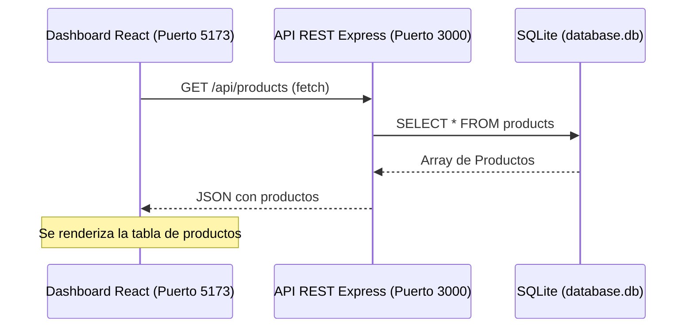

# Documentación de Diseño — User Story #5: Integración con la API Backend

> Estado histórico: esta documentación describe la etapa donde el dashboard consumía Express/SQLite. La entrega actual funciona React-only con `localStorage`. Ver `docs/US12_Persistencia_Local_Auth_Admin.md`.

Esta documentación detalla la transición del panel de control de **Mi Ecommerce** (Sprint 5) desde una simulación local con mocks y alertas a una conexión real y operativa con el servidor Express (`Web-1`) respaldado por una base de datos SQLite.

---

## 🏛️ Diseño de la Arquitectura de Integración

La comunicación entre el Frontend y el Backend está desacoplada, siguiendo un patrón clásico de cliente-servidor mediante una API RESTful:



---

## 🔌 Detalles de la Implementación de Conectividad

### 1. Cliente API Centralizado (`src/utils/api.ts`)
Para consumir los datos del catálogo, el dashboard utiliza la función genérica `apiFetch<T>` para encapsular las peticiones `fetch`.
* **Configuración del Host:** Apunta a la URL base `http://localhost:3000/api`.
* **Seguridad de Tipos:** Emplea genéricos de TypeScript para tipar la respuesta (por ejemplo, `apiFetch<ProductData>(...)`), garantizando consistencia en el pintado de datos en el cliente.
* **Control de Respuesta Sin Cuerpo:** Maneja adecuadamente el código de estado `204 No Content` enviado por las peticiones de eliminación (`DELETE`), evitando fallos al intentar parsear JSON vacío.

### 2. Configuración CORS (Cross-Origin Resource Sharing)
Dado que el frontend se ejecuta en `http://localhost:5173` y el backend en `http://localhost:3000`, los navegadores bloquean las llamadas directas por políticas del mismo origen (SOP).
* **Solución:** Se habilitó el middleware `cors` en el backend Express configurando explícitamente los encabezados para permitir las solicitudes originadas desde el puerto `5173`.

### 3. Sincronización y Consistencia de Campos Especiales (Stock y Status)
Para que el dashboard pudiera renderizar las estadísticas críticas de inventario, se expandió el esquema de la base de datos de Express (`products` en SQLite) para soportar dos nuevas propiedades críticas:
* **`stock` (INTEGER)**: Almacena las unidades disponibles. Por defecto toma el valor `20` en productos existentes o creados sin valor.
* **`status` (TEXT)**: Representa el estado comercial del artículo (`Activo`, `Stock Bajo`, o `Sin Stock`).

#### Sistema de Migración Automática (`ensureProductsTable`):
Para evitar corrupciones o errores en instalaciones existentes que no contaban con estas columnas, se añadió una migración automática en `db/bootstrap.js` que se ejecuta al inicio del servidor Express:
```javascript
function ensureProductsTable(db) {
    const columns = db.prepare('PRAGMA table_info(products)').all();
    const hasStock = columns.some((column) => column.name === 'stock');
    const hasStatus = columns.some((column) => column.name === 'status');

    if (!hasStock) {
        db.exec('ALTER TABLE products ADD COLUMN stock INTEGER DEFAULT 20');
    }
    if (!hasStatus) {
        db.exec("ALTER TABLE products ADD COLUMN status TEXT DEFAULT 'Activo'");
    }
}
```

#### Reglas de Negocio para el Estado Comercial:
En el backend, las funciones `createProduct` y `updateProduct` en `services/productsService.js` administran el estado comercial de forma inteligente:
1. Si al crear o actualizar el producto se modifica el `stock` pero no se define un `status` explícito, el backend calcula el estado de forma automática:
   * `stock === 0` $\rightarrow$ `'Sin Stock'`
   * `stock <= 12` $\rightarrow$ `'Stock Bajo'`
   * `stock > 12` $\rightarrow$ `'Activo'`
2. Esto asegura que la base de datos almacene un estado coherente que el frontend de React puede mostrar mediante colores informativos sin recalcular la lógica en cada renderizado.

#### 📷 Carga de Fotos Locales (`/api/upload`):
Para permitir subir imágenes del dispositivo y cargarlas en el ecommerce:
1. **Frontend (React)**: Se incorporó un botón de tipo archivo (`input type="file"`) camuflado bajo estilos de Material Design 3. Al seleccionar un archivo, se empaqueta en un objeto `FormData` y se envía al endpoint `/api/upload` omitiendo el encabezado por defecto `'Content-Type': 'application/json'` de `apiFetch`.
2. **Backend (Express)**: Utiliza el middleware `multer` para procesar peticiones `multipart/form-data`. Las imágenes se almacenan directamente en el directorio físico del proyecto `/assets/productos` con un identificador único. El backend responde con la ruta relativa del recurso generado (ej: `/assets/productos/upload-1719...png`).
3. **Visualización Cruzada**:
   * **Ecommerce (SSR)**: Como las imágenes se guardan en la carpeta `/assets/productos` de `Web-1`, el sitio de compras puede cargarlas de forma nativa usando rutas relativas.
   * **Dashboard (React SPA)**: En la vista previa del producto, se mapea la URL local agregando el prefijo del host del servidor backend (`http://localhost:3000`) si la ruta es relativa, logrando consistencia visual instantánea.

### 4. Operaciones CRUD Soportadas e Integradas
Las páginas de administración del catálogo se conectan a los siguientes endpoints REST:

| Entidad | Endpoint | Método HTTP | Acción en el Backend |
| :--- | :--- | :--- | :--- |
| **Productos** | `/api/products` | `GET` | Obtener listado con soporte de ordenamiento y búsqueda |
| | `/api/products` | `POST` | Insertar un nuevo producto en SQLite con su stock y estado |
| | `/api/products/:id` | `GET` | Cargar los datos de un producto específico |
| | `/api/products/:id` | `PUT` | Actualizar campos e invalidar/actualizar stock y estado |
| | `/api/products/:id` | `DELETE` | Eliminar registro de producto en SQLite |
| **Carga de Fotos** | `/api/upload` | `POST` | Subir archivo de imagen local y obtener la URL relativa del asset |
| **Categorías**| `/api/categories` | `GET` | Obtener listado de categorías |
| | `/api/categories` | `POST` | Registrar nueva categoría en SQLite |
| | `/api/categories/:id` | `GET` | Obtener los detalles de la categoría |
| | `/api/categories/:id` | `PUT` | Actualizar la información de la categoría |
| | `/api/categories/:id` | `DELETE` | Eliminar registro de categoría en SQLite |

---

## 🛠️ Validación y Pruebas
* **Carga de Datos:** Al ingresar al Home, el panel calcula dinámicamente las estadísticas de cantidad de productos, total de categorías y stock crítico directamente consultando los endpoints REST, eliminando el estado mockeado.
* **Integridad Relacional:** Los formularios de alta y modificación guardan los cambios de forma síncrona en el archivo de base de datos SQLite del backend.
